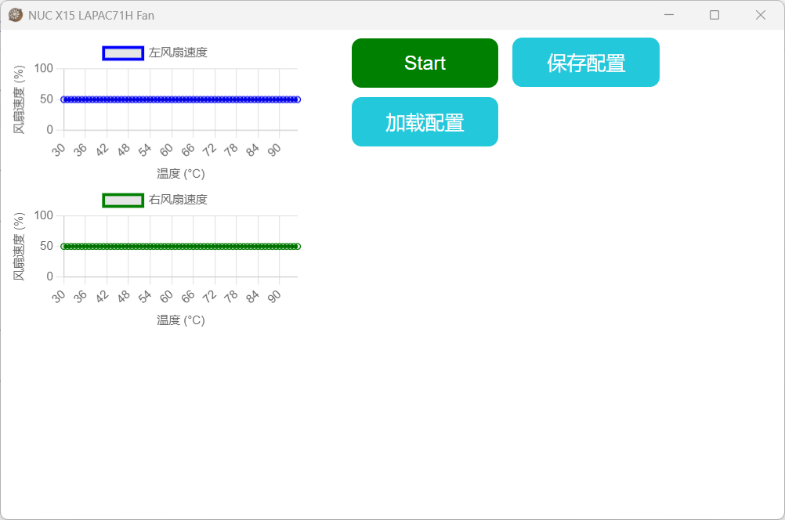
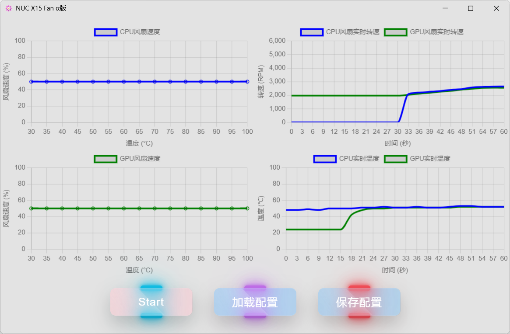

# NUCtool
intel NUC 系列风扇曲线控制 LAPAC71H, LAPKC71F 等机型

> 随缘更新

### --> [更新说明及使用说明](./src-tauri/NUCtoolChange.md) <--

### --> [必要说明](assets/分析.md) <--

#### ----------------------------------------------------
### 0.1.2版本运行界面

### 0.3.0版本运行界面

